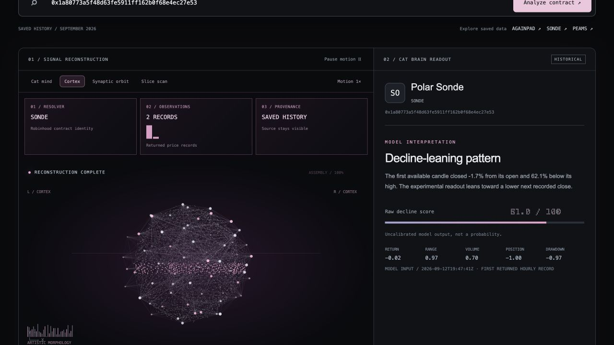
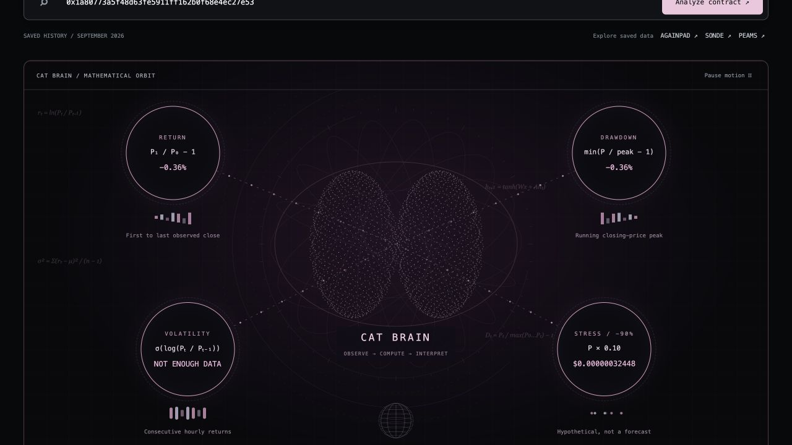
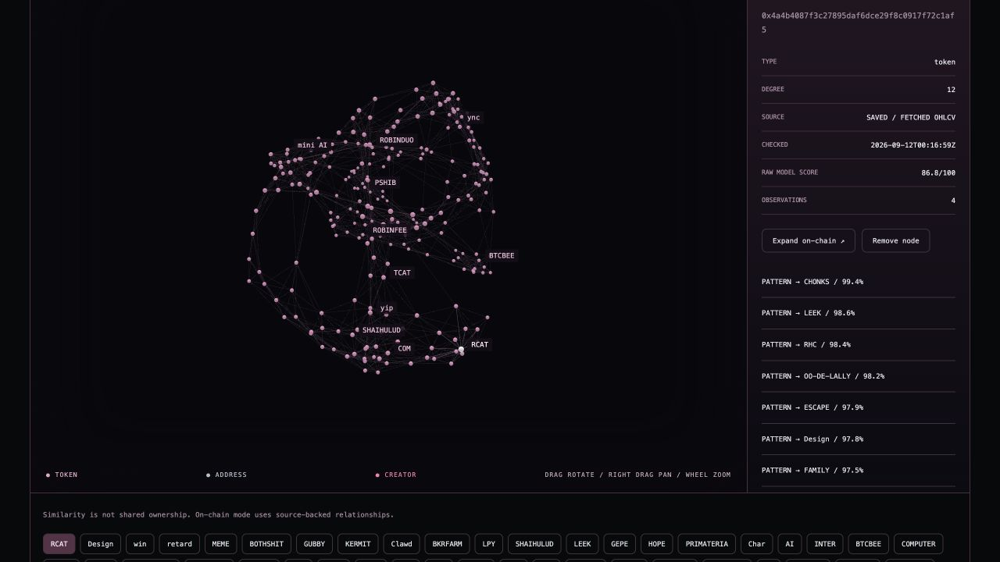
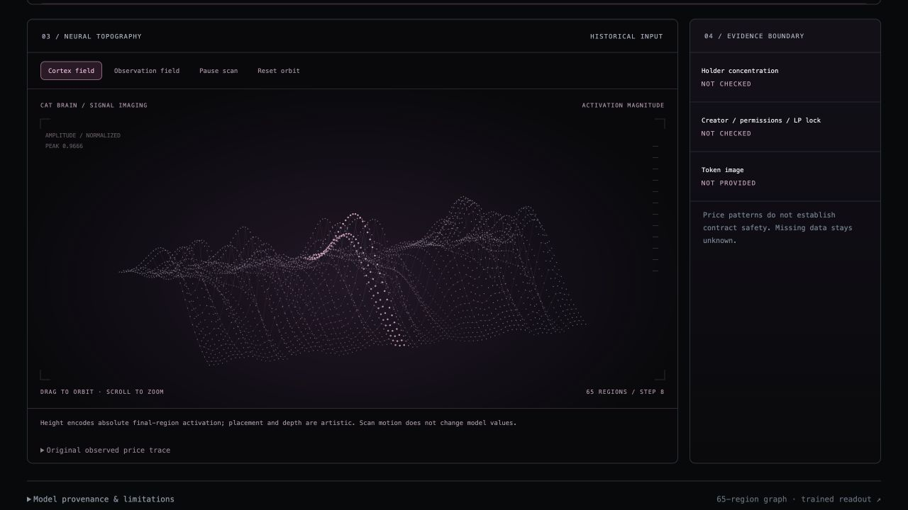
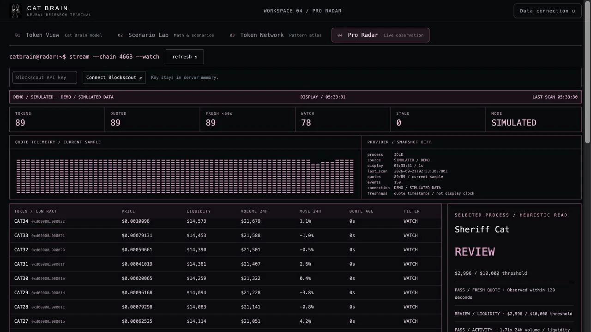

# Inside CATBRAIN

A visual tour of the research terminal. These are application captures from saved historical examples and explicitly labeled simulated data. They demonstrate the interface, not current market conditions. The cover is generated project artwork.

[← Back to the project](../README.md)

## The cortical readout

A saved token candle is encoded into five features and propagated through the fixed regional network. The readout is experimental and uncalibrated.

## Mathematical context

Observed returns and drawdown sit beside explicit formulas. An insufficient sample remains visibly insufficient rather than producing invented statistics.

## Pattern atlas

A saved token collection becomes a selectable 3D similarity graph. This view represents feature similarity. Actual transfer and holder evidence is explored separately in on-chain mode.

## Neural topography

The particle surface encodes regional activation magnitudes. Its spatial layout is artistic; it is not a holder map or an anatomical brain scan.

## Observation radar

This capture is in simulated mode. In live mode, provider connectivity, timestamps and missing-data states determine which observations can be inspected.

## Try the walkthrough

1. Run `npm run demo` from the repository root.
2. Select a saved example in Token View and wait for reconstruction to complete.
3. Open Scenario Lab to inspect the same historical observations.
4. Open Token Network and load the saved pattern collection. Rotate the graph and select a node.
5. Open Pro Radar to inspect the clearly labeled simulated stream.

For real on-chain evidence, restart in live mode and connect your own Blockscout key. Never include keys, personal wallet collections or local session URLs in screenshots.
